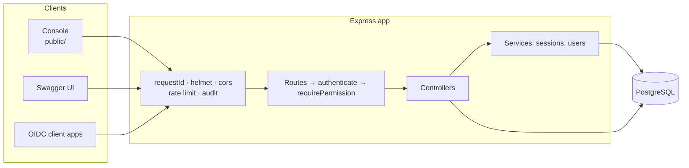
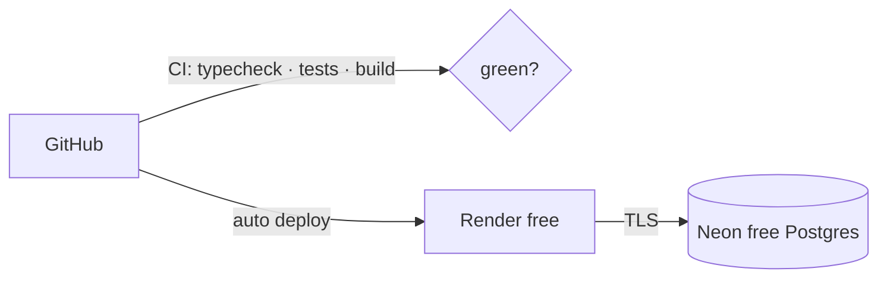

# SecureAccess

**Authentication, authorization, MFA, audit trail and an OpenID Connect provider — built with Express, TypeScript, Prisma and PostgreSQL.**

[](https://github.com/Ramraghul/Secure_Access/actions/workflows/ci.yml)


[](LICENSE)

SecureAccess is the "security guard" layer an application sits behind. It handles who a user is (registration, login, MFA), what they may do (roles and permissions), what they did (audit trail), and lets other apps offer **"Sign in with SecureAccess"** via OpenID Connect.

It ships with an **interactive console** that calls the real API and shows every request, **Swagger UI**, **216 automated tests**, and one-click deployment configs for **free hosting**.

> **Live demo:** `https://<your-deployment>` · Demo logins: `auditor@secureaccess.dev` / `Auditor!Demo#2026` (read-only admin) and `demo@secureaccess.dev` / `DemoUser!Try#2026`

---

## Features

| Area | What you get |
|---|---|
| **Accounts** | Registration with a strong password policy, bcrypt hashing, profile updates, password change |
| **Login hardening** | Account lockout after 5 failures, no user enumeration (identical errors and timing), per-IP rate limits |
| **Multi-factor auth** | TOTP (Google Authenticator, 1Password…), QR enrolment, 10 one-time backup codes, replay protection; asked on every login unless the user opts in to remember a device for 30 days |
| **Sessions** | 15-minute JWT access tokens bound to server-side sessions, rotating refresh tokens with **reuse detection**, sign out one session or everywhere |
| **RBAC** | Roles made of `action:resource` permissions with `manage` and `*` wildcards; changes apply on the next request |
| **Devices** | Device recognition and naming, trust management, remote sign-out per device |
| **Audit trail** | Every API request recorded with semantic events, secrets masked, search, statistics, CSV export and retention purge |
| **OpenID Connect provider** | Authorization Code + PKCE, RS256 `id_token`s, JWKS, UserInfo, refresh tokens, revocation, client registry |
| **Developer experience** | OpenAPI 3 docs (tested to cover every route), consistent error format, request IDs, structured logging |
| **Operations** | Health check, graceful shutdown, Docker image, Render blueprint, Vercel support, GitHub Actions CI |

## Tech stack

**Runtime** Node.js 22 · Express 4 · TypeScript 5 (strict) — **Data** PostgreSQL 16 · Prisma 5 — **Security** jsonwebtoken · bcryptjs · speakeasy (TOTP) · helmet · express-rate-limit · Zod — **Quality** Jest · Supertest · swagger-parser · GitHub Actions — **Frontend** vanilla HTML/CSS/JS, no build step

---

## Architecture



Every process — registration, login, MFA, token rotation, RBAC, auditing and the OIDC flow — is explained step by step with diagrams in **[docs/FLOWS.md](docs/FLOWS.md)**.

---

## Quick start

**Prerequisites:** Node.js 22 and Docker (or any PostgreSQL 14+).

**1. Install**

```bash
git clone https://github.com/Ramraghul/Secure_Access.git
cd Secure_Access
npm install
```

**2. Start PostgreSQL** (port 5433; also creates the test database)

```bash
docker compose up -d db
```

**3. Configure**

```bash
cp .env.example .env
```

The defaults in `.env.example` already match the Docker database. For anything beyond local use, change `JWT_SECRET`.

**4. Create tables and seed data**

```bash
npx prisma migrate deploy
```

```bash
npm run seed
```

> **Upgrading an existing database?** If you see `The column … does not exist`, the code is newer than your schema. Run the two commands above again — `migrate deploy` only applies the migrations that are missing. The server also warns about pending migrations at startup and in `/health`.
>
> **Seeing `Unknown argument …` from Prisma?** The running server loaded an older Prisma Client than `schema.prisma`. Stop and start `npm run dev` — it now runs `prisma generate` first and restarts by itself whenever the client is regenerated.

**5. Run**

```bash
npm run dev
```

| Open | URL |
|---|---|
| Interactive console | http://localhost:4000/ |
| Swagger UI | http://localhost:4000/api-docs/ |
| Health check | http://localhost:4000/health |
| OIDC discovery | http://localhost:4000/.well-known/openid-configuration |

<details>
<summary>Run everything in Docker instead</summary>

```bash
docker compose --profile app up -d --build
```

The API container applies migrations and seeds on start.

</details>

### Seeded accounts

| Email | Password | Role | Notes |
|---|---|---|---|
| `admin@secureaccess.dev` | `ChangeMe!Local#2026` | admin (`manage:*`) | Local default only — set `SEED_ADMIN_PASSWORD` in production |
| `auditor@secureaccess.dev` | `Auditor!Demo#2026` | auditor (read-only admin) | Protected: cannot be modified |
| `demo@secureaccess.dev` | `DemoUser!Try#2026` | user | Protected: cannot be modified |

A demo OpenID Connect client, `secureaccess-demo`, is also registered.

---

## Using it

**Console** — sign in with a demo account, then explore the tabs: tokens and claims, MFA enrolment, devices and sessions, users, roles, the audit log, and a full OpenID Connect sign-in you can watch step by step. The **Request log** panel shows each API call with secrets hidden.

**Swagger UI** — run `POST /api/v1/auth/login`, copy `accessToken`, click **Authorize**, paste it, and try any endpoint.

**curl**

```bash
curl -s -X POST http://localhost:4000/api/v1/auth/login \
  -H "Content-Type: application/json" \
  -d '{"email":"auditor@secureaccess.dev","password":"Auditor!Demo#2026"}'
```

See **[docs/API.md](docs/API.md)** for every endpoint, examples, the error catalogue and a curl walkthrough.

### Endpoints at a glance

| Group | Endpoints |
|---|---|
| Auth | `POST /auth/register` · `/login` · `/login/mfa` · `/refresh` · `/logout` · `/logout-all` · `/change-password` |
| Profile & sessions | `GET·PATCH /auth/me` · `GET /auth/sessions` · `DELETE /auth/sessions/{id}` |
| MFA | `POST /auth/mfa/setup` · `/verify` · `/disable` |
| Devices | `GET /devices` · `GET /devices/current` · `POST /devices/{id}/trust` · `/revoke` · `DELETE /devices/{id}` |
| Users | `GET /users` · `GET·DELETE /users/{id}` · `POST /users/{id}/activate` · `/deactivate` · `/reset-password` |
| Roles | `GET·POST /roles` · `GET·PUT·DELETE /roles/{id}` · `POST /roles/{id}/assign` · `/revoke` |
| Audit | `GET /audit` · `/audit/events` · `/audit/retention` · `POST /audit/export` · `/audit/purge` |
| OpenID Connect | `/.well-known/openid-configuration` · `/openid/jwks` · `/authorize` · `/consent` · `/token` · `/userinfo` · `/revoke` · `/clients` |

All paths are under `/api/v1` except discovery and `/health`.

---

## Project structure

```text
secureaccess/
├── src/
│   ├── app.ts                 # Express app: middleware order, routers, static console
│   ├── server.ts              # HTTP listener, graceful shutdown (exports app for Vercel)
│   ├── config/                # All environment configuration, validated at startup
│   ├── controllers/           # auth · user · role · device · audit · openid
│   ├── routes/                # URL → middleware → controller wiring
│   ├── middleware/            # authenticate · requirePermission · audit · rate limits · errors
│   ├── services/              # sessions (rotation, revocation) · user helpers
│   ├── openid/                # OIDC client validation, RS256 token signing
│   ├── utils/                 # jwt · password · mfa · crypto · masking · permissions · validation
│   ├── lib/                   # prisma client · logger · signing keys
│   ├── swagger/               # OpenAPI spec + Swagger UI page
│   └── db/seed.ts             # idempotent seed
├── prisma/
│   ├── schema.prisma
│   └── migrations/            # v2 baseline + v3 migration
├── public/                    # console (index.html, app.js), OAuth consent & callback pages
├── tests/
│   ├── unit/                  # 100 tests, no database
│   └── integration/           # 116 tests, real HTTP + PostgreSQL
├── docs/                      # FLOWS · API · SECURITY · TESTING · DEPLOYMENT
├── scripts/generate-keys.ts   # RSA key for OIDC_PRIVATE_KEY
├── Dockerfile · docker-compose.yml · render.yaml · vercel.json
└── .github/workflows/ci.yml
```

## Scripts

| Command | Purpose |
|---|---|
| `npm run dev` | Generate Prisma Client, then start with auto-reload (also reloads when the client is regenerated) |
| `npm run build` / `npm start` | Compile to `dist/` / run the compiled server |
| `npm test` | All tests (needs the test database) |
| `npm run test:unit` · `test:integration` · `test:coverage` | Subsets / coverage report |
| `npm run typecheck` | TypeScript check of source, tests and scripts |
| `npm run migrate` | Create a migration after editing `schema.prisma` (development) |
| `npm run migrate:deploy` | Apply pending migrations |
| `npm run seed` · `seed:prod` | Seed via ts-node / compiled JavaScript |
| `npm run keys:generate` | Print a new `OIDC_PRIVATE_KEY` |
| `npm run studio` | Browse the database with Prisma Studio |

---

## Testing

```bash
docker compose up -d db
```

```bash
npm test
```

**216 tests** — unit tests for every security primitive (including the RFC 7636 PKCE vector) and integration tests that exercise real flows against PostgreSQL: lockout, MFA replay, refresh-token reuse, RBAC changes taking effect, audit masking, the full OIDC code flow with JWKS signature verification, and a check that **every route is documented in the OpenAPI spec**. Details: **[docs/TESTING.md](docs/TESTING.md)**.

## Deployment (free)

**Recommended:** Render (free web service) + Neon (free PostgreSQL). The included `render.yaml` builds, migrates, seeds and health-checks automatically.



Step-by-step instructions for Render, Neon, Supabase and Docker hosts, plus upgrading an existing v2 database: **[docs/DEPLOYMENT.md](docs/DEPLOYMENT.md)**.

**Deploying to Vercel?** Follow **[docs/VERCEL.md](docs/VERCEL.md)** — database setup (Supabase session pooler / Neon), environment variables, the build pipeline, updating the existing deployment, and how Swagger UI is bundled.

## Security

Threat model, design decisions, the 17 vulnerabilities fixed from v2, and known limitations: **[docs/SECURITY.md](docs/SECURITY.md)**.

---

## What's new in v3

| Area | v2 | v3 |
|---|---|---|
| Tokens | 7-day JWT; refresh JWT also accepted as an access token | 15-minute access token tied to a revocable session; single-use rotating refresh tokens with reuse detection |
| Logout | Not possible | Logout, sign out everywhere, per-session and per-device revocation |
| MFA | Any password login trusted the device; backup codes unusable; no replay protection | Trust only after MFA; backup codes; replay-safe TOTP; two-step login with `mfaToken`; disable flow |
| Login | No lockout | Lockout, constant-time failures, failure-only rate limiting |
| RBAC | Hard-coded `admin` name check; `manage`/`*` ignored | Pure permission model with wildcards; system role and last-admin guards |
| Audit | Tokens and MFA secrets stored in plaintext; only authenticated routes | Deep masking; every request incl. failed auth; semantic events; purge |
| OpenID Connect | Stub endpoints returning tokens for a fake user | Real Authorization Code + PKCE provider, RS256, JWKS, UserInfo, revocation |
| Docs | Swagger blank on Vercel, spec out of date | Swagger UI served from `swagger-ui-dist` and bundled for Vercel; spec validated and route coverage tested |
| Tests | None | 216 unit + integration tests, CI |
| Console | None | Interactive console, consent and callback pages |
| Deployment | Vercel only | Render + Neon blueprint, Docker, Vercel |

## Documentation

| Document | Contents |
|---|---|
| [docs/FLOWS.md](docs/FLOWS.md) | Step-by-step processes with sequence, flow and state diagrams |
| [docs/API.md](docs/API.md) | Endpoint reference, examples, error catalogue, curl walkthrough |
| [docs/SECURITY.md](docs/SECURITY.md) | Threat model, defences, fixed vulnerabilities, limitations |
| [docs/TESTING.md](docs/TESTING.md) | Running, structure and coverage of the test suite |
| [docs/DEPLOYMENT.md](docs/DEPLOYMENT.md) | Free-tier deployment guides and environment reference |
| [docs/VERCEL.md](docs/VERCEL.md) | Vercel deployment, step by step with diagrams |
| `/api-docs` | Interactive OpenAPI documentation |

## License

[MIT](LICENSE) © Raghul
