# How SecureAccess Works — Step by Step

This guide walks through every process in the system, in the order a request actually experiences it.
Each section has a plain-English explanation, the exact steps, a diagram, and a way to try it yourself.

> Diagrams use [Mermaid](https://mermaid.js.org/) and render automatically on GitHub.
> The quickest way to *see* these flows is the console at `http://localhost:4000/` — its **Request log** panel shows every call.

## Contents

1. [The big picture](#1-the-big-picture)
2. [Life of a request (middleware pipeline)](#2-life-of-a-request)
3. [Registration](#3-registration)
4. [Login (no MFA)](#4-login-without-mfa)
5. [Account lockout](#5-account-lockout)
6. [Enrolling in MFA](#6-enrolling-in-mfa)
7. [Login with MFA and trusted devices](#7-login-with-mfa)
8. [Calling a protected endpoint](#8-calling-a-protected-endpoint)
9. [Refresh-token rotation and reuse detection](#9-refresh-token-rotation)
10. [Logout, sign-out everywhere and other revocations](#10-revocation)
11. [RBAC permission checks](#11-rbac-permission-checks)
12. [Device recognition](#12-device-recognition)
13. [The audit trail](#13-the-audit-trail)
14. [OpenID Connect: Authorization Code + PKCE](#14-openid-connect)
15. [Admin operations](#15-admin-operations)

---

## 1. The big picture

SecureAccess is a single Express application. The same process serves the JSON API, the Swagger docs and a small static console.

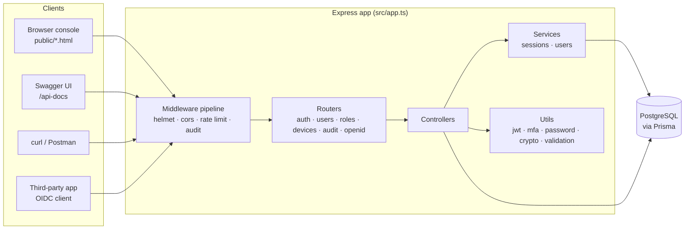
```mermaid
flowchart LR
    subgraph Clients
        B[Browser console<br/>public/*.html]
        S[Swagger UI<br/>/api-docs]
        C[curl / Postman]
        A[Third-party app<br/>OIDC client]
    end

    subgraph Server["Express app (src/app.ts)"]
        MW[Middleware pipeline<br/>helmet · cors · rate limit · audit]
        R[Routers<br/>auth · users · roles · devices · audit · openid]
        CT[Controllers]
        SV[Services<br/>sessions · users]
        U[Utils<br/>jwt · mfa · password · crypto · validation]
    end

    DB[(PostgreSQL<br/>via Prisma)]

    B & S & C & A --> MW --> R --> CT
    CT --> SV --> DB
    CT --> U
    CT --> DB
```

**Data model** (see `prisma/schema.prisma`):

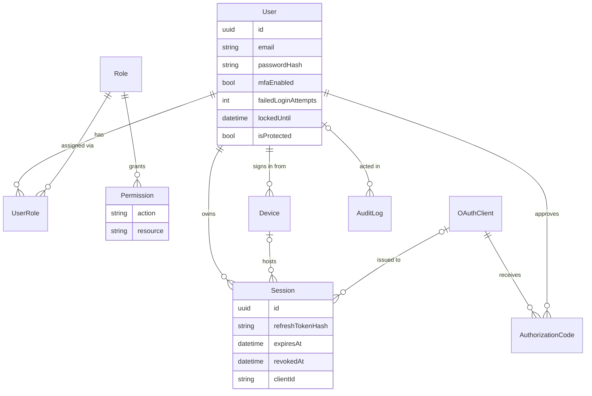
```mermaid
erDiagram
    User ||--o{ UserRole : has
    Role ||--o{ UserRole : "assigned via"
    Role ||--o{ Permission : grants
    User ||--o{ Device : "signs in from"
    User ||--o{ Session : owns
    Device |o--o{ Session : "hosts"
    OAuthClient |o--o{ Session : "issued to"
    OAuthClient ||--o{ AuthorizationCode : receives
    User ||--o{ AuthorizationCode : approves
    User |o--o{ AuditLog : "acted in"

    User {
        uuid id
        string email
        string passwordHash
        bool mfaEnabled
        int failedLoginAttempts
        datetime lockedUntil
        bool isProtected
    }
    Session {
        uuid id
        string refreshTokenHash
        datetime expiresAt
        datetime revokedAt
        string clientId
    }
    Permission {
        string action
        string resource
    }
```

| Table | Why it exists |
|---|---|
| `users` | Accounts, password hash, MFA secret, lockout counters |
| `roles`, `permissions`, `user_roles` | RBAC: a role is a set of `action:resource` permissions |
| `devices` | Browsers/phones a user signed in from; trusted devices skip MFA |
| `sessions` | One row per sign-in. Backs the refresh token and makes revocation instant |
| `audit_logs` | Every API request, with secrets masked |
| `oauth_clients`, `authorization_codes` | The OpenID Connect provider |

---

## 2. Life of a request

Every call to `/api/v1/*` passes through the same pipeline. Order matters: for example the audit logger is attached *before* authentication so failed attempts are recorded too.

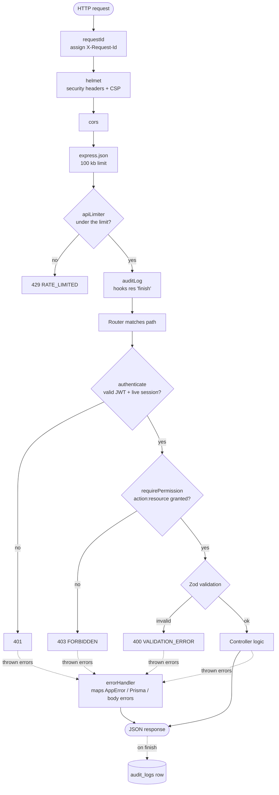
```mermaid
flowchart TD
    IN([HTTP request]) --> RID[requestId<br/>assign X-Request-Id]
    RID --> HEL[helmet<br/>security headers + CSP]
    HEL --> CORS[cors]
    CORS --> BODY[express.json<br/>100 kb limit]
    BODY --> RL{apiLimiter<br/>under the limit?}
    RL -- no --> R429[429 RATE_LIMITED]
    RL -- yes --> AUD[auditLog<br/>hooks res 'finish']
    AUD --> ROUTE[Router matches path]
    ROUTE --> AUTH{authenticate<br/>valid JWT + live session?}
    AUTH -- no --> R401[401]
    AUTH -- yes --> PERM{requirePermission<br/>action:resource granted?}
    PERM -- no --> R403[403 FORBIDDEN]
    PERM -- yes --> VAL{Zod validation}
    VAL -- invalid --> R400[400 VALIDATION_ERROR]
    VAL -- ok --> CTRL[Controller logic]
    CTRL --> RES([JSON response])
    R401 & R403 & R400 & CTRL -. thrown errors .-> ERR[errorHandler<br/>maps AppError / Prisma / body errors]
    ERR --> RES
    RES -. on finish .-> WRITE[(audit_logs row)]
```

**Steps**

1. `requestId` reuses a valid incoming `X-Request-Id` or creates a UUID. It is echoed in the response header, every error body and the audit row, so one ID ties them together.
2. `helmet` adds `Content-Security-Policy`, `X-Content-Type-Options`, `Strict-Transport-Security`, etc.
3. `cors` answers preflight requests. Tokens travel in the `Authorization` header (never cookies), so cross-origin credentials are not needed.
4. The JSON body parser rejects bodies over 100 kb (`413`) and malformed JSON (`400 INVALID_JSON`).
5. `apiLimiter` caps each IP (default 300 requests / 15 min). Credential endpoints add `authLimiter`, which counts only *failed* attempts.
6. `auditLog` registers a listener; the row is written after the response is sent.
7. Routers apply `authenticate` and `requirePermission` where needed.
8. Controllers validate input with Zod and throw typed `AppError`s; `errorHandler` turns every failure into `{ error, message, details?, requestId }`.

---

## 3. Registration

**What happens:** the password is checked against the strength rules, hashed with bcrypt (12 rounds), and the account gets the default `user` role.

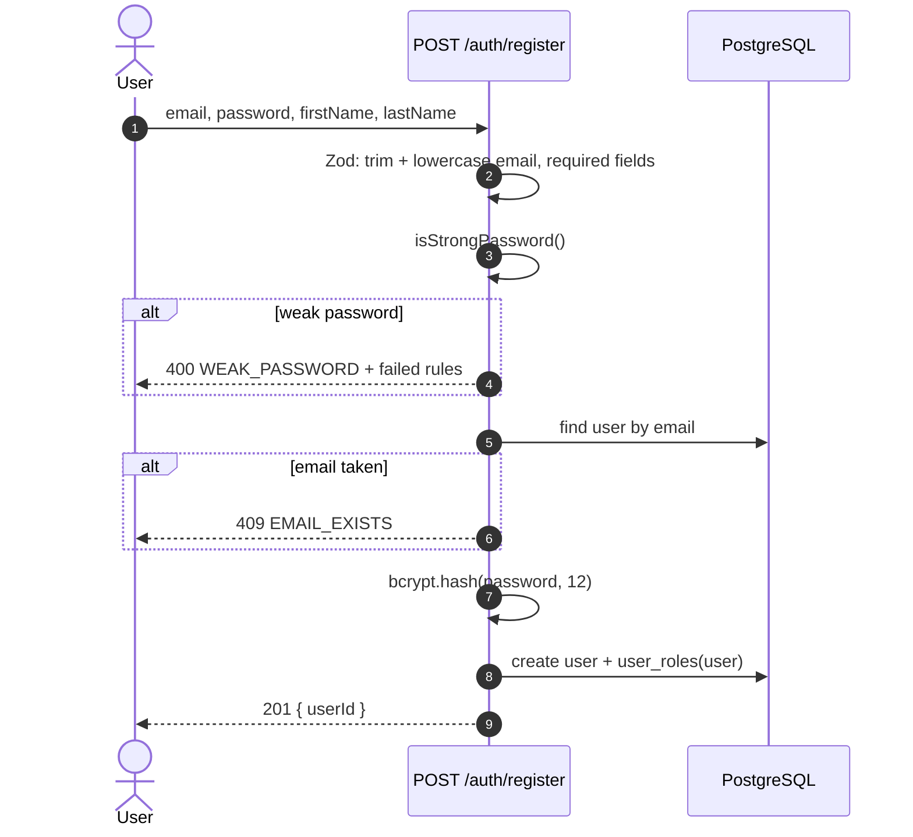
```mermaid
sequenceDiagram
    autonumber
    actor U as User
    participant API as POST /auth/register
    participant DB as PostgreSQL

    U->>API: email, password, firstName, lastName
    API->>API: Zod: trim + lowercase email, required fields
    API->>API: isStrongPassword()
    alt weak password
        API-->>U: 400 WEAK_PASSWORD + failed rules
    end
    API->>DB: find user by email
    alt email taken
        API-->>U: 409 EMAIL_EXISTS
    end
    API->>API: bcrypt.hash(password, 12)
    API->>DB: create user + user_roles(user)
    API-->>U: 201 { userId }
```

**Password rules:** 12–128 characters, upper, lower, digit, symbol, no character repeated 4+ times in a row, none of the common words `password`, `123456`, `qwerty`, `admin`, `letmein`.

**Try it**

```bash
curl -X POST http://localhost:4000/api/v1/auth/register \
  -H "Content-Type: application/json" \
  -d '{"email":"jane@example.com","password":"Str0ng!Passphrase","firstName":"Jane","lastName":"Doe"}'
```

---

## 4. Login without MFA

**What happens:** the password is verified, the device is recorded, a **session** is created, and two tokens are returned:

| Token | Format | Lifetime | Stored on the server as |
|---|---|---|---|
| `accessToken` | HS512 JWT with `sub`, `email`, `sid` (session id) | 15 minutes | nothing — but `sid` must point at a live session |
| `refreshToken` | opaque `<sessionId>.<random secret>` | 7 days | SHA-256 of the secret in `sessions.refreshTokenHash` |

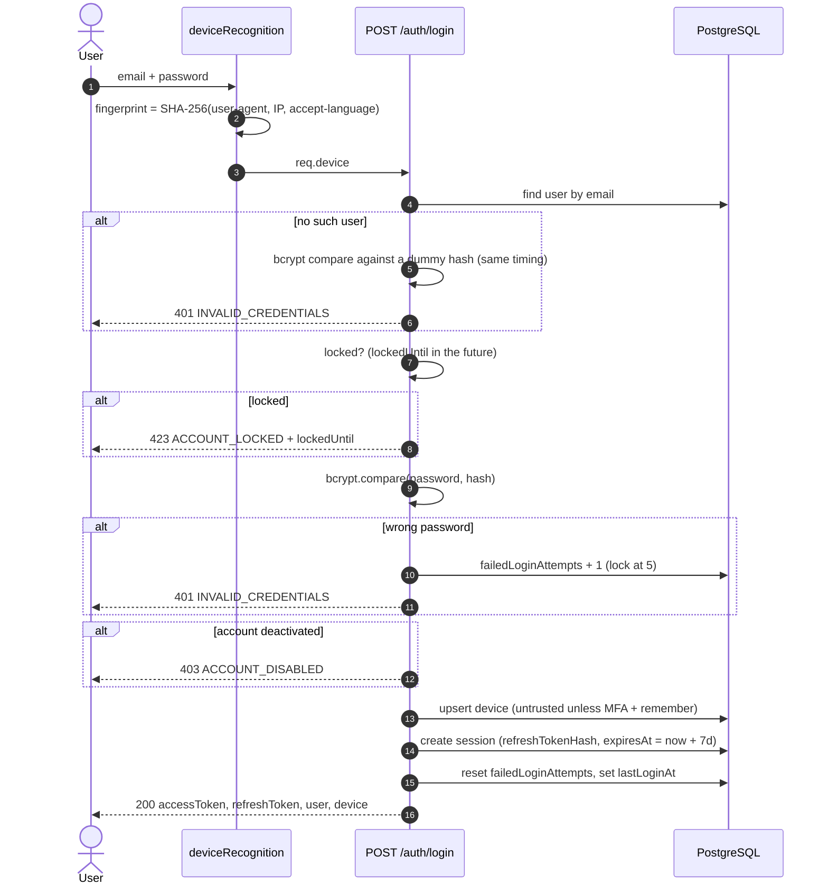
```mermaid
sequenceDiagram
    autonumber
    actor U as User
    participant DEV as deviceRecognition
    participant API as POST /auth/login
    participant DB as PostgreSQL

    U->>DEV: email + password
    DEV->>DEV: fingerprint = SHA-256(user-agent, IP, accept-language)
    DEV->>API: req.device
    API->>DB: find user by email
    alt no such user
        API->>API: bcrypt compare against a dummy hash (same timing)
        API-->>U: 401 INVALID_CREDENTIALS
    end
    API->>API: locked? (lockedUntil in the future)
    alt locked
        API-->>U: 423 ACCOUNT_LOCKED + lockedUntil
    end
    API->>API: bcrypt.compare(password, hash)
    alt wrong password
        API->>DB: failedLoginAttempts + 1 (lock at 5)
        API-->>U: 401 INVALID_CREDENTIALS
    end
    alt account deactivated
        API-->>U: 403 ACCOUNT_DISABLED
    end
    API->>DB: upsert device (untrusted unless MFA + remember)
    API->>DB: create session (refreshTokenHash, expiresAt = now + 7d)
    API->>DB: reset failedLoginAttempts, set lastLoginAt
    API-->>U: 200 accessToken, refreshToken, user, device
```

**Why these details matter**

- **Same answer for unknown email and wrong password** — attackers cannot discover which emails are registered. The dummy bcrypt comparison makes the response time identical too.
- **Deactivation is revealed only after the correct password** — so it does not leak account status either.
- **The access token names a session (`sid`)** — that is what lets logout work instantly (section 8).

**Try it**

```bash
curl -X POST http://localhost:4000/api/v1/auth/login \
  -H "Content-Type: application/json" \
  -d '{"email":"jane@example.com","password":"Str0ng!Passphrase"}'
```

---

## 5. Account lockout

Wrong passwords **and** wrong MFA codes count toward the same limit.

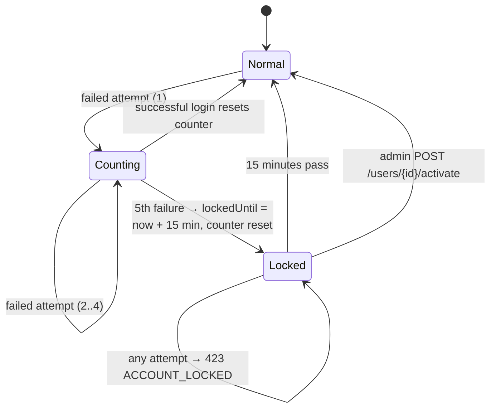
```mermaid
stateDiagram-v2
    [*] --> Normal
    Normal --> Counting: failed attempt (1)
    Counting --> Counting: failed attempt (2..4)
    Counting --> Normal: successful login resets counter
    Counting --> Locked: 5th failure → lockedUntil = now + 15 min, counter reset
    Locked --> Locked: any attempt → 423 ACCOUNT_LOCKED
    Locked --> Normal: 15 minutes pass
    Locked --> Normal: admin POST /users/{id}/activate
```

| Setting | Default | Env var |
|---|---|---|
| Attempts before lock | 5 | `MAX_FAILED_LOGINS` |
| Lock duration | 15 min | `LOCKOUT_MINUTES` |

Protected demo accounts are exempt: their password is public, so locking them would only let a visitor deny the demo to everyone else.

---

## 6. Enrolling in MFA

MFA uses TOTP (RFC 6238) — the 6-digit codes from Google Authenticator, 1Password, Authy and similar apps.

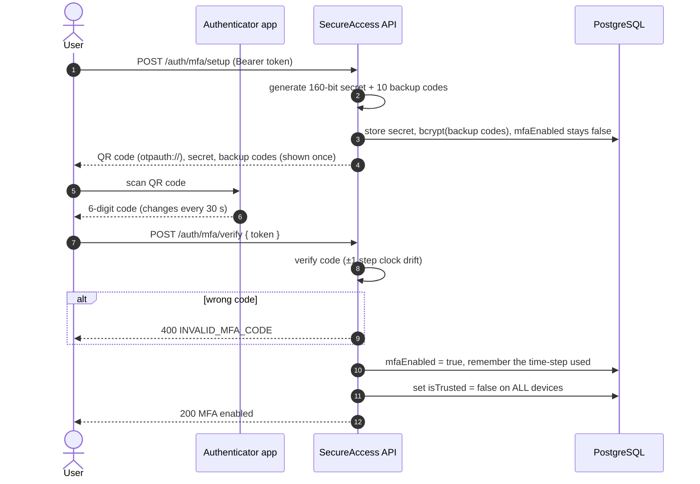
```mermaid
sequenceDiagram
    autonumber
    actor U as User
    participant APP as Authenticator app
    participant API as SecureAccess API
    participant DB as PostgreSQL

    U->>API: POST /auth/mfa/setup (Bearer token)
    API->>API: generate 160-bit secret + 10 backup codes
    API->>DB: store secret, bcrypt(backup codes), mfaEnabled stays false
    API-->>U: QR code (otpauth://), secret, backup codes (shown once)
    U->>APP: scan QR code
    APP-->>U: 6-digit code (changes every 30 s)
    U->>API: POST /auth/mfa/verify { token }
    API->>API: verify code (±1 step clock drift)
    alt wrong code
        API-->>U: 400 INVALID_MFA_CODE
    end
    API->>DB: mfaEnabled = true, remember the time-step used
    API->>DB: set isTrusted = false on ALL devices
    API-->>U: 200 MFA enabled
```

**Steps**

1. **Setup** creates the secret but does *not* turn MFA on — a user who never finishes enrolment is not locked out.
2. **Backup codes** are shown once and stored only as bcrypt hashes. Each works exactly once.
3. **Verify** proves the app is configured correctly, then enables MFA.
4. **Every device loses trust**, so each one must pass MFA once before it can be remembered.
5. Calling setup again while enabled returns `409 MFA_ALREADY_ENABLED` — a stolen access token cannot silently re-enrol MFA.

**Disabling** (`POST /auth/mfa/disable`) requires the password **and** a current code or backup code.

---

## 7. Login with MFA

Once MFA is enabled, **every login asks for a code**. The only exception is a browser the user explicitly chose to remember (the *Remember this device for 30 days* box at the MFA step, unticked by default).

Login becomes two steps. The first step returns **202 Accepted** with a short-lived `mfaToken`, so the client never has to send the password again.

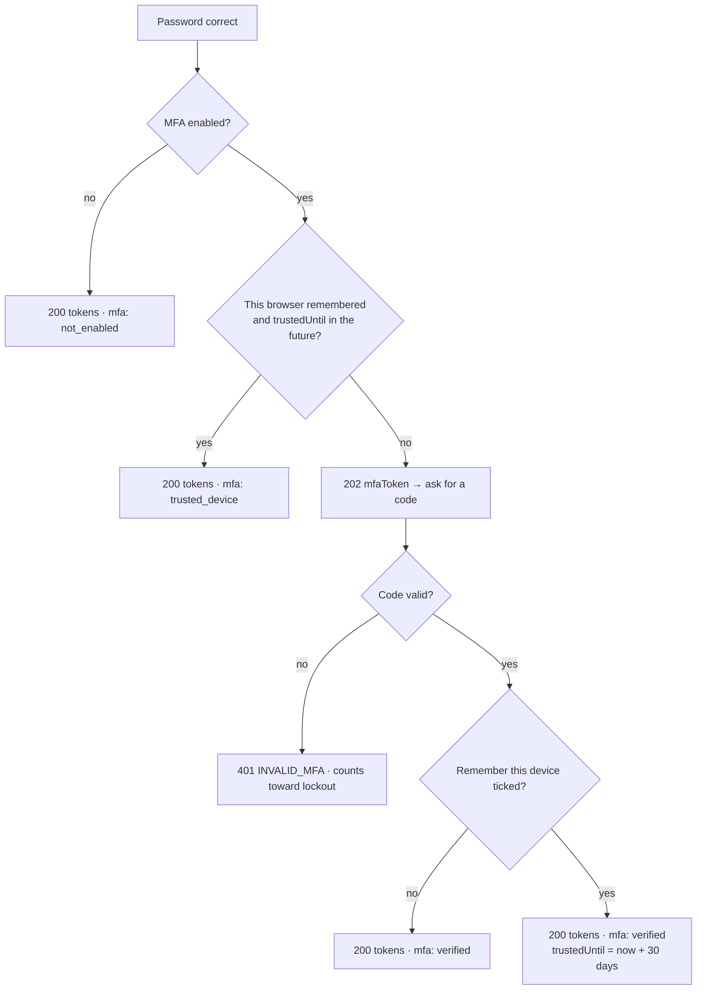
```mermaid
flowchart TD
    P[Password correct] --> E{MFA enabled?}
    E -- no --> T1["200 tokens · mfa: not_enabled"]
    E -- yes --> R{"This browser remembered<br/>and trustedUntil in the future?"}
    R -- yes --> T2["200 tokens · mfa: trusted_device"]
    R -- no --> C["202 mfaToken → ask for a code"]
    C --> V{Code valid?}
    V -- no --> F[401 INVALID_MFA · counts toward lockout]
    V -- yes --> M{Remember this device ticked?}
    M -- no --> T3["200 tokens · mfa: verified"]
    M -- yes --> T4["200 tokens · mfa: verified<br/>trustedUntil = now + 30 days"]
```

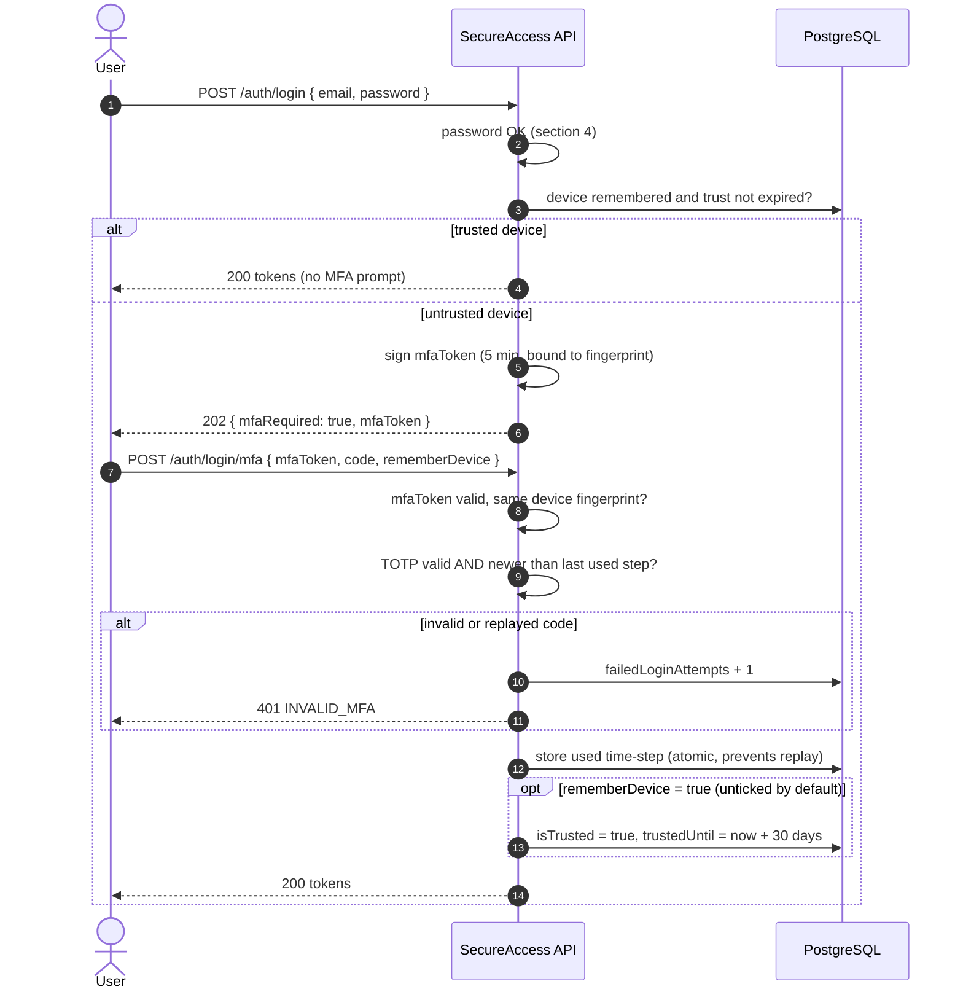
```mermaid
sequenceDiagram
    autonumber
    actor U as User
    participant API as SecureAccess API
    participant DB as PostgreSQL

    U->>API: POST /auth/login { email, password }
    API->>API: password OK (section 4)
    API->>DB: device remembered and trust not expired?
    alt trusted device
        API-->>U: 200 tokens (no MFA prompt)
    else untrusted device
        API->>API: sign mfaToken (5 min, bound to fingerprint)
        API-->>U: 202 { mfaRequired: true, mfaToken }
        U->>API: POST /auth/login/mfa { mfaToken, code, rememberDevice }
        API->>API: mfaToken valid, same device fingerprint?
        API->>API: TOTP valid AND newer than last used step?
        alt invalid or replayed code
            API->>DB: failedLoginAttempts + 1
            API-->>U: 401 INVALID_MFA
        end
        API->>DB: store used time-step (atomic, prevents replay)
        opt rememberDevice = true (unticked by default)
            API->>DB: isTrusted = true, trustedUntil = now + 30 days
        end
        API-->>U: 200 tokens
    end
```

**Security properties**

| Protection | How |
|---|---|
| Code replay | The accepted 30-second time-step is stored; the same or an older step is rejected. The update is conditional, so two concurrent requests cannot both succeed. |
| MFA token theft | The token is signed with the device fingerprint; using it from another browser fails. It expires after 5 minutes and cannot be used as an access token (different `type` claim). |
| Brute force of 6 digits | Each wrong code counts toward the 5-attempt lockout. |
| Backup codes | `backupCode` instead of `code`; the matched hash is removed atomically. |
| Remembered devices | Opt-in only, for 30 days (`TRUSTED_DEVICE_DAYS`). Trusting a device later via `POST /devices/{id}/trust` also requires a fresh code. Trust is cleared when MFA is enabled or disabled and when the password changes. |
| Transparency | Every successful login says how MFA was handled: `mfa: verified`, `trusted_device` (with `device.trustedUntil`) or `not_enabled`. |

**Single-step alternative:** send `totp_code` (or `backupCode`) together with the password to `/auth/login`.

---

## 8. Calling a protected endpoint

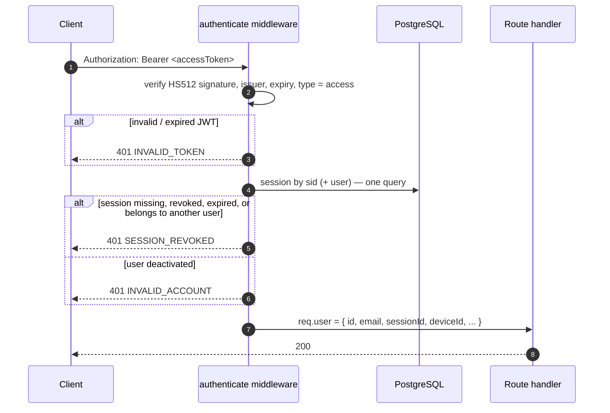
```mermaid
sequenceDiagram
    autonumber
    participant C as Client
    participant AUTH as authenticate middleware
    participant DB as PostgreSQL
    participant H as Route handler

    C->>AUTH: Authorization: Bearer <accessToken>
    AUTH->>AUTH: verify HS512 signature, issuer, expiry, type = access
    alt invalid / expired JWT
        AUTH-->>C: 401 INVALID_TOKEN
    end
    AUTH->>DB: session by sid (+ user) — one query
    alt session missing, revoked, expired, or belongs to another user
        AUTH-->>C: 401 SESSION_REVOKED
    else user deactivated
        AUTH-->>C: 401 INVALID_ACCOUNT
    end
    AUTH->>H: req.user = { id, email, sessionId, deviceId, ... }
    H-->>C: 200
```

JWTs are normally impossible to revoke before they expire. Checking the session row on each request is what makes **logout, password changes and deactivation take effect immediately** — at the cost of one indexed primary-key lookup.

---

## 9. Refresh-token rotation

Access tokens last 15 minutes. The client exchanges its refresh token for a new pair. **Every refresh token works exactly once.**

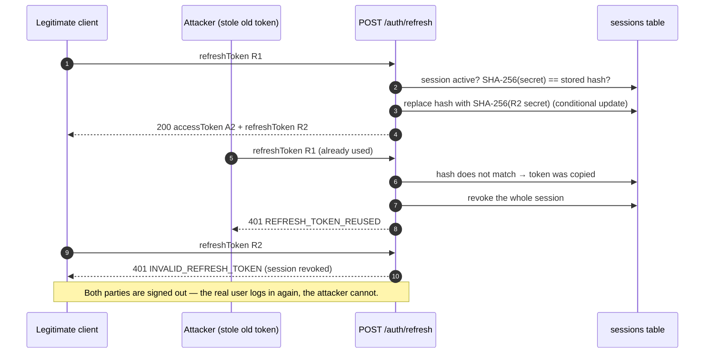
```mermaid
sequenceDiagram
    autonumber
    participant C as Legitimate client
    participant X as Attacker (stole old token)
    participant API as POST /auth/refresh
    participant DB as sessions table

    C->>API: refreshToken R1
    API->>DB: session active? SHA-256(secret) == stored hash?
    API->>DB: replace hash with SHA-256(R2 secret) (conditional update)
    API-->>C: 200 accessToken A2 + refreshToken R2

    X->>API: refreshToken R1 (already used)
    API->>DB: hash does not match → token was copied
    API->>DB: revoke the whole session
    API-->>X: 401 REFRESH_TOKEN_REUSED

    C->>API: refreshToken R2
    API-->>C: 401 INVALID_REFRESH_TOKEN (session revoked)
    Note over C,API: Both parties are signed out — the real user logs in again, the attacker cannot.
```

**Steps**

1. The token is split into `sessionId` and `secret`.
2. The session must exist, belong to the same client type, be unrevoked, unexpired, and its user active.
3. The secret is hashed and compared in constant time.
4. **Match:** a new secret is generated and stored with a conditional `UPDATE … WHERE refreshTokenHash = old`, so two parallel refreshes cannot both win.
5. **Mismatch:** the token is an old one → the session is revoked (theft detection).

The console's **Rotate tokens** button and the `api()` helper in `public/common.js` do this automatically when an access token expires.

---

## 10. Revocation

Every action below revokes session rows, so affected access tokens stop working on their next request.

| Action | Endpoint | Sessions revoked |
|---|---|---|
| Sign out | `POST /auth/logout` | current session |
| Sign out everywhere | `POST /auth/logout-all` | all of the user's sessions |
| Revoke one session | `DELETE /auth/sessions/{id}` | that session |
| Change password | `POST /auth/change-password` | all **except** the current one (and every device must pass MFA again) |
| Remove a device | `DELETE /devices/{id}` | sessions on that device |
| Admin deactivates user | `POST /users/{id}/deactivate` | all of that user's sessions |
| Admin resets password | `POST /users/{id}/reset-password` | all of that user's sessions |
| Refresh token reuse | `POST /auth/refresh` | that session |
| OIDC code replay / client revoke | `POST /openid/token`, `POST /openid/revoke` | sessions issued from that grant |

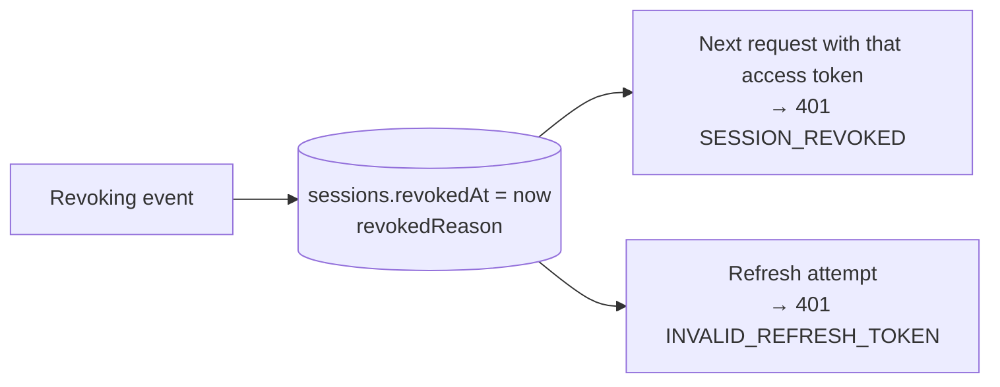
```mermaid
flowchart LR
    E[Revoking event] --> S[(sessions.revokedAt = now<br/>revokedReason)]
    S --> A[Next request with that access token<br/>→ 401 SESSION_REVOKED]
    S --> R[Refresh attempt<br/>→ 401 INVALID_REFRESH_TOKEN]
```

---

## 11. RBAC permission checks

A **permission** is `action:resource`. A **role** is a named set of permissions. Users can hold several roles.

- Actions: `create`, `read`, `update`, `delete`, `manage`, `export`
- Resources: `user`, `role`, `user-role`, `audit`, `client`
- Wildcards: `manage` implies every action; resource `*` matches every resource

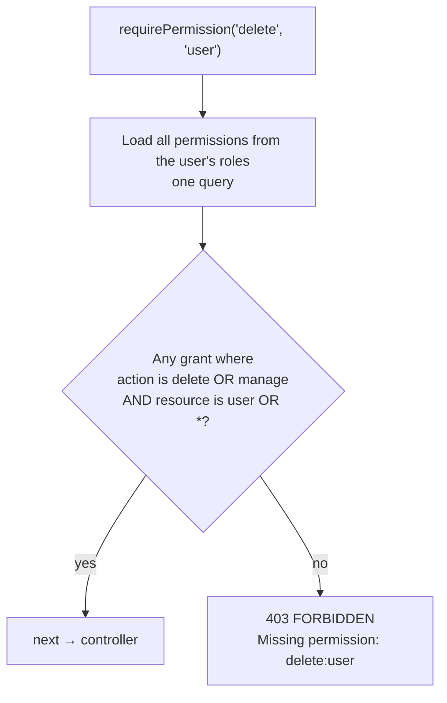
```mermaid
flowchart TD
    REQ["requirePermission('delete', 'user')"] --> LOAD[Load all permissions from the user's roles<br/>one query]
    LOAD --> LOOP{Any grant where<br/>action is delete OR manage<br/>AND resource is user OR *?}
    LOOP -- yes --> NEXT[next → controller]
    LOOP -- no --> DENY["403 FORBIDDEN<br/>Missing permission: delete:user"]
```

**Seeded roles**

| Role | Permissions | Meaning |
|---|---|---|
| `admin` | `manage:*` | everything |
| `auditor` | `read:user`, `read:role`, `read:client`, `read:audit`, `export:audit` | read-only administration |
| `user` | none | own account only (every signed-in user can manage their profile, MFA, devices and sessions) |

**Guard rails:** system roles cannot be renamed, re-permissioned or deleted; the last administrator cannot lose the `admin` role; protected demo accounts cannot have roles changed.

**Endpoint → permission map**

| Endpoint | Permission |
|---|---|
| `GET /users`, `GET /users/{id}` | `read:user` |
| `POST /users/{id}/activate`, `/deactivate` | `update:user` |
| `POST /users/{id}/reset-password` | `manage:user` |
| `DELETE /users/{id}` | `delete:user` |
| `GET /roles`, `GET /roles/{id}` | `read:role` |
| `POST /roles` · `PUT /roles/{id}` · `DELETE /roles/{id}` | `create:role` · `update:role` · `delete:role` |
| `POST /roles/{id}/assign`, `/revoke` | `manage:user-role` |
| `GET /audit`, `/audit/events`, `/audit/retention` | `read:audit` |
| `POST /audit/export` | `export:audit` |
| `POST /audit/purge` | `manage:audit` |
| `GET /openid/clients` · `POST` · `DELETE` | `read:client` · `create:client` · `delete:client` |

---

## 12. Device recognition

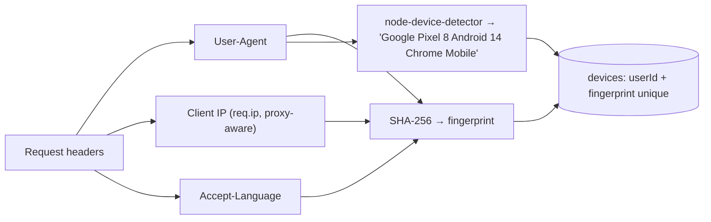
```mermaid
flowchart LR
    H[Request headers] --> UA[User-Agent]
    H --> IP["Client IP (req.ip, proxy-aware)"]
    H --> L[Accept-Language]
    UA & IP & L --> FP["SHA-256 → fingerprint"]
    UA --> DD["node-device-detector → 'Google Pixel 8 Android 14 Chrome Mobile'"]
    FP --> ROW[(devices: userId + fingerprint unique)]
    DD --> ROW
```

1. The fingerprint changes when the browser, network (IP) or language changes — a new network is treated as a new device on purpose.
2. A device becomes **trusted** only after passing MFA with *remember this device* ticked, or when the signed-in user trusts it **and confirms with a current MFA code**. Trust expires after 30 days, and a trusted device is the only case where MFA is skipped.
3. Removing a device signs out its sessions.
4. Other users' device IDs return `404`, never `403`, so IDs cannot be probed.

`req.ip` honours Express's `trust proxy` setting (`TRUST_PROXY=1` for Render/Vercel), so a client cannot spoof its IP by sending an `X-Forwarded-For` header.

---

## 13. The audit trail

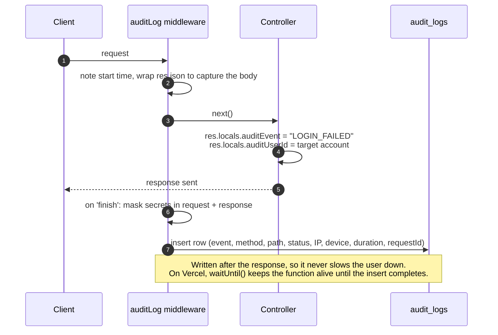
```mermaid
sequenceDiagram
    autonumber
    participant C as Client
    participant AUD as auditLog middleware
    participant CTRL as Controller
    participant DB as audit_logs

    C->>AUD: request
    AUD->>AUD: note start time, wrap res.json to capture the body
    AUD->>CTRL: next()
    CTRL->>CTRL: res.locals.auditEvent = "LOGIN_FAILED"<br/>res.locals.auditUserId = target account
    CTRL-->>C: response sent
    AUD->>AUD: on 'finish': mask secrets in request + response
    AUD->>DB: insert row (event, method, path, status, IP, device, duration, requestId)
    Note over AUD,DB: Written after the response, so it never slows the user down.<br/>On Vercel, waitUntil() keeps the function alive until the insert completes.
```

**What a row contains**

| Column / field | Example |
|---|---|
| `event` | `LOGIN_SUCCESS`, `MFA_ENABLED`, `ROLE_ASSIGNED`, `REFRESH_TOKEN_REUSED` |
| `action`, `resource`, `statusCode` | `POST`, `/api/v1/auth/login`, `200` |
| `userId` | the signed-in user, or the account a login targeted |
| `metadata.requestBody` | `{"email":"jane@example.com","password":"••••••"}` |
| `metadata.responseSnippet` | first 500 chars of the masked response (non-GET or errors) |
| `metadata.requestId`, `device`, `durationMs` | correlation and forensics |

**Masking** replaces the values of keys such as `password`, `token`, `refreshToken`, `secret`, `backupCodes`, `qrCode`, `code`, `code_verifier`, `client_secret`, `redirectTo` — at any depth, case-insensitively.

**Reading it:** `GET /audit` (paginated, filterable), `GET /audit/events` (flattened search with an off-hours flag), `GET /audit/retention` (statistics), `POST /audit/export` (CSV, with formula-injection escaping), `POST /audit/purge` (retention).

---

## 14. OpenID Connect

SecureAccess is also an **identity provider**: other apps can offer "Sign in with SecureAccess". The flow is **Authorization Code with PKCE**, the current best practice for browser and mobile apps.

### Actors

| Actor | In this repo |
|---|---|
| Relying party (the app) | `public/oauth/callback.html` — the "SecureAccess Demo App" |
| Authorization server | `/api/v1/openid/*` |
| Consent screen | `public/oauth/consent.html` |
| Registered client | `secureaccess-demo` (public client, PKCE required) |

### The full flow

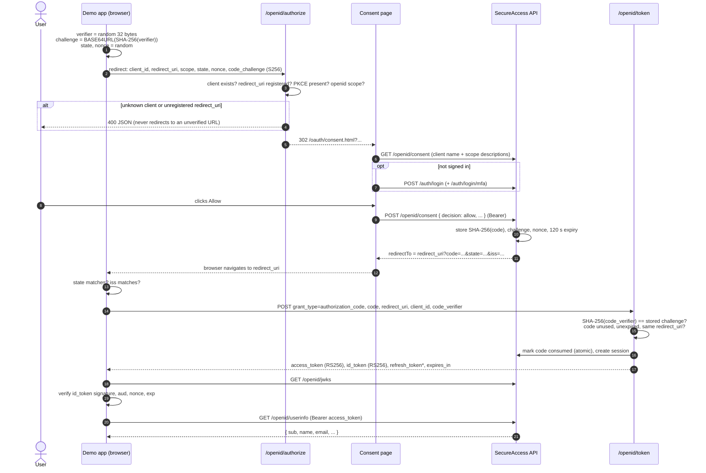
```mermaid
sequenceDiagram
    autonumber
    actor U as User
    participant RP as Demo app (browser)
    participant AZ as /openid/authorize
    participant CS as Consent page
    participant API as SecureAccess API
    participant TK as /openid/token

    RP->>RP: verifier = random 32 bytes<br/>challenge = BASE64URL(SHA-256(verifier))<br/>state, nonce = random
    RP->>AZ: redirect: client_id, redirect_uri, scope, state, nonce, code_challenge (S256)
    AZ->>AZ: client exists? redirect_uri registered? PKCE present? openid scope?
    alt unknown client or unregistered redirect_uri
        AZ-->>U: 400 JSON (never redirects to an unverified URL)
    end
    AZ-->>CS: 302 /oauth/consent.html?...
    CS->>API: GET /openid/consent (client name + scope descriptions)
    opt not signed in
        CS->>API: POST /auth/login (+ /auth/login/mfa)
    end
    U->>CS: clicks Allow
    CS->>API: POST /openid/consent { decision: allow, ... } (Bearer)
    API->>API: store SHA-256(code), challenge, nonce, 120 s expiry
    API-->>CS: redirectTo = redirect_uri?code=...&state=...&iss=...
    CS-->>RP: browser navigates to redirect_uri
    RP->>RP: state matches? iss matches?
    RP->>TK: POST grant_type=authorization_code, code, redirect_uri, client_id, code_verifier
    TK->>TK: SHA-256(code_verifier) == stored challenge?<br/>code unused, unexpired, same redirect_uri?
    TK->>API: mark code consumed (atomic), create session
    TK-->>RP: access_token (RS256), id_token (RS256), refresh_token*, expires_in
    RP->>API: GET /openid/jwks
    RP->>RP: verify id_token signature, aud, nonce, exp
    RP->>API: GET /openid/userinfo (Bearer access_token)
    API-->>RP: { sub, name, email, ... }
```

\* `refresh_token` is issued only when the `offline_access` scope was granted.

### Why each piece exists

| Mechanism | Stops |
|---|---|
| Exact `redirect_uri` match | Codes being sent to an attacker's site |
| `state` | CSRF — a response the app never asked for |
| PKCE (`code_challenge` / `code_verifier`) | A stolen authorization code being exchanged by someone else |
| `nonce` in the id_token | Replaying an old id_token |
| `iss` in the redirect (RFC 9207) | Mix-up attacks between multiple providers |
| 120-second, single-use codes; replay revokes issued tokens | Code interception and reuse |
| RS256 + public JWKS | Apps verifying tokens without sharing a secret |
| Separate token types | An OIDC access token cannot call first-party `/api/v1/*` endpoints, and vice versa |

### Scopes and claims

| Scope | Claims released |
|---|---|
| `openid` (required) | `sub` |
| `profile` | `name`, `given_name`, `family_name` |
| `email` | `email`, `email_verified` |
| `offline_access` | a `refresh_token` |

### Confidential clients

Server-side apps can be registered with `isConfidential: true`. They receive a `client_secret` once (stored as a SHA-256 hash) and authenticate at the token endpoint with HTTP Basic (`client_secret_basic`) or form fields (`client_secret_post`). PKCE is optional for them.

### Refresh and revocation

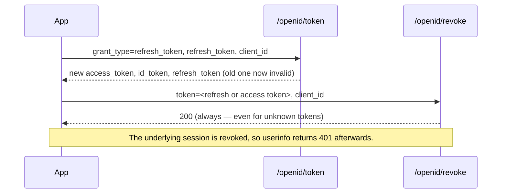
```mermaid
sequenceDiagram
    participant RP as App
    participant TK as /openid/token
    participant RV as /openid/revoke
    RP->>TK: grant_type=refresh_token, refresh_token, client_id
    TK-->>RP: new access_token, id_token, refresh_token (old one now invalid)
    RP->>RV: token=<refresh or access token>, client_id
    RV-->>RP: 200 (always — even for unknown tokens)
    Note over RP,RV: The underlying session is revoked, so userinfo returns 401 afterwards.
```

**Try it:** sign in to the console → **OpenID Connect** tab → **Sign in to the demo app with SecureAccess**. The callback page ticks off each verification step.

---

## 15. Admin operations

### Temporary password reset

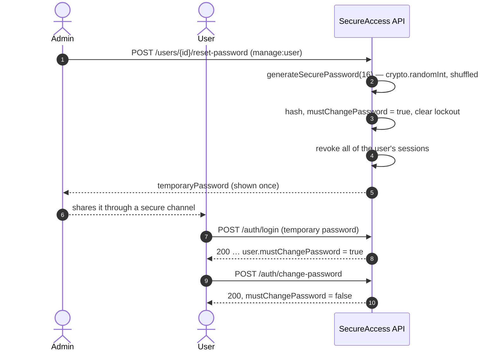
```mermaid
sequenceDiagram
    autonumber
    actor A as Admin
    actor U as User
    participant API as SecureAccess API
    A->>API: POST /users/{id}/reset-password (manage:user)
    API->>API: generateSecurePassword(16) — crypto.randomInt, shuffled
    API->>API: hash, mustChangePassword = true, clear lockout
    API->>API: revoke all of the user's sessions
    API-->>A: temporaryPassword (shown once)
    A-->>U: shares it through a secure channel
    U->>API: POST /auth/login (temporary password)
    API-->>U: 200 … user.mustChangePassword = true
    U->>API: POST /auth/change-password
    API-->>U: 200, mustChangePassword = false
```

### Deactivate / activate

1. `POST /users/{id}/deactivate` sets `isActive = false` and revokes every session. Admins cannot deactivate themselves.
2. The user's existing tokens fail with `401`; logging in with the correct password returns `403 ACCOUNT_DISABLED`.
3. `POST /users/{id}/activate` restores access and also clears any lockout.

### Protected demo accounts

Accounts seeded with `isProtected = true` (`auditor@secureaccess.dev`, `demo@secureaccess.dev`) can be used by anyone visiting a public deployment, but the API refuses to change their password, profile, MFA or roles, deactivate or delete them (`403 PROTECTED_ACCOUNT`). Re-running the seed resets them to a known state.
