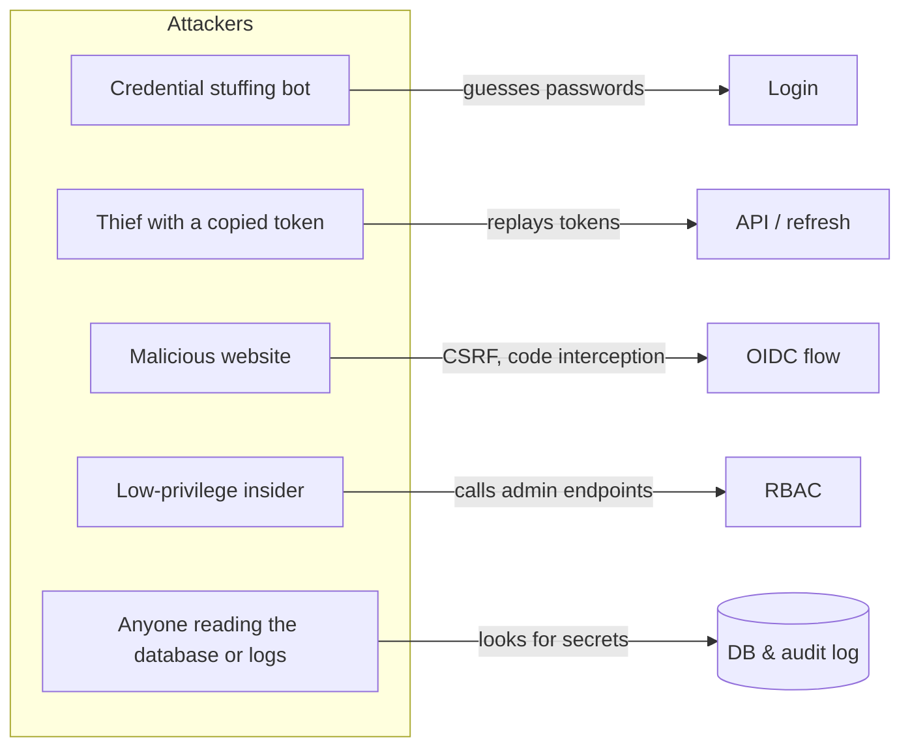
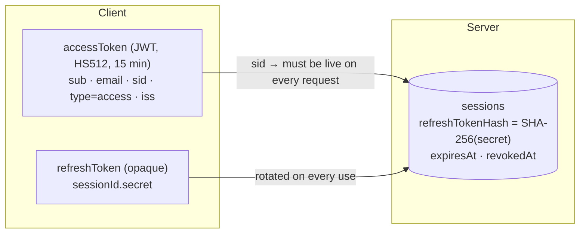

# Security Design

This document explains the threats SecureAccess defends against, how each defence works, where it lives in the code, and the known limitations.

## Contents

1. [Threat model](#1-threat-model)
2. [Credentials](#2-credentials)
3. [Tokens and sessions](#3-tokens-and-sessions)
4. [Multi-factor authentication](#4-multi-factor-authentication)
5. [Authorization (RBAC)](#5-authorization-rbac)
6. [Audit logging](#6-audit-logging)
7. [OpenID Connect provider](#7-openid-connect-provider)
8. [HTTP hardening](#8-http-hardening)
9. [Vulnerabilities fixed from v2](#9-vulnerabilities-fixed-from-v2)
10. [Known limitations](#10-known-limitations)

---

## 1. Threat model

| Threat | Defence | Code |
|---|---|---|
| Password guessing | bcrypt (12 rounds), lockout after 5 failures, failure-only rate limit on credential routes | `utils/password.ts`, `services/user.service.ts`, `middleware/rateLimit.middleware.ts` |
| Account enumeration | Identical error and timing for unknown email vs wrong password; status revealed only after the correct password | `controllers/auth.controller.ts` (`burnPasswordCheck`) |
| Stolen password | TOTP MFA with backup codes, asked on every login; device trust is opt-in, needs a code and expires after 30 days | `utils/mfa.ts`, `auth.controller.ts` |
| Stolen access token | 15-minute lifetime, bound to a server-side session that can be revoked | `utils/jwt.ts`, `middleware/auth.middleware.ts` |
| Stolen refresh token | Single-use rotation; reuse revokes the session | `services/session.service.ts` |
| MFA code replay / brute force | Time-step replay guard (atomic), attempts count toward lockout | `auth.controller.ts` (`verifySecondFactor`) |
| Privilege escalation | Permission checks on every admin route, system role guards, last-admin guard | `middleware/rbac.middleware.ts`, `controllers/role.controller.ts` |
| Secrets leaking into logs | Deep masking before audit writes; hashes never returned by the API | `utils/mask.ts`, `services/user.service.ts` (`sanitizeUser`) |
| OIDC code interception / CSRF / mix-up | PKCE S256, exact redirect URI match, `state`, `nonce`, `iss`, single-use 120 s codes | `openid/clients.ts`, `controllers/openid.controller.ts` |
| IP spoofing | `req.ip` with an explicit `trust proxy` hop count, never raw `X-Forwarded-For` | `utils/request.ts` |
| XSS in the console | CSP `script-src 'self'`, all DOM built with `textContent` (no `innerHTML`) | `app.ts`, `public/common.js` |
| CSV formula injection | Cells beginning with `= + - @` are prefixed with `'` | `controllers/audit.controller.ts` (`csvCell`) |
| Denial of service | Rate limits, 100 kb body limit, bounded page sizes | `app.ts`, `utils/validation.ts` |

---

## 2. Credentials

| Aspect | Decision |
|---|---|
| Hashing | bcrypt, cost 12 (configurable via `BCRYPT_ROUNDS`) |
| Policy | 12–128 chars; upper, lower, digit, symbol; no 4 identical characters in a row; blocks common words |
| Temporary passwords | `crypto.randomInt` (unbiased CSPRNG), guaranteed character classes at shuffled positions, forces `mustChangePassword` |
| Password change | Requires the current password; revokes all other sessions |
| Lockout | 5 failures → 15 minutes. Counter is atomic (`increment`). MFA failures count too |
| Protected demo accounts | Exempt from lockout and all credential changes — their passwords are public by design |

---

## 3. Tokens and sessions

**Design choices**

- **Algorithm pinning:** verification accepts only `HS512` and issuer `secureaccess`, so `alg: none` and algorithm-confusion tokens are rejected.
- **Typed tokens:** the `type` claim (`access` or `mfa`) is checked; an MFA token cannot be used as an access token.
- **Opaque refresh tokens:** they are not JWTs, so they carry no readable data and can only be validated against the database. Only a SHA-256 hash of the 256-bit secret is stored — a database leak does not expose usable refresh tokens.
- **Constant-time comparison** (`crypto.timingSafeEqual`) for refresh-token and client-secret hashes.
- **Race safety:** rotation uses a conditional `UPDATE … WHERE refreshTokenHash = <old>`; if two requests race, one wins and the session is treated as compromised.
- **Separation of token families:** first-party tokens (HS512, shared secret) and OIDC tokens (RS256, public JWKS) are verified by different code paths and are not interchangeable.

---

## 4. Multi-factor authentication

| Aspect | Decision |
|---|---|
| Algorithm | TOTP, SHA-1, 6 digits, 30-second step (the authenticator-app standard) |
| Secret | 160 bits (RFC 4226 recommendation) |
| Clock drift | ±1 step (±30 s) |
| Replay | Last accepted step stored; only newer steps accepted, via conditional update |
| Enrolment | Not active until the first code verifies; re-enrolment while enabled is refused (`409`) |
| Backup codes | 10 × 40-bit codes, bcrypt-hashed, single use, consumed atomically |
| Disabling | Password **and** a code or backup code |
| Trusted devices | Opt-in only (unticked by default) after a successful MFA step, or via `POST /devices/{id}/trust` with a fresh code; expire after 30 days (`TRUSTED_DEVICE_DAYS`); cleared when MFA is enabled/disabled and when the password changes or is reset |
| Two-step login | 202 + `mfaToken` (5 minutes, bound to the device fingerprint) — the password is not sent twice |

---

## 5. Authorization (RBAC)

- **Deny by default:** admin routes are wrapped with `requirePermission(action, resource)`. A user with no roles can only use self-service endpoints.
- **No name-based shortcuts:** access comes from permissions, not from a role being called `admin` (the seeded admin simply holds `manage:*`).
- **Immediate effect:** permissions are loaded on each request, so assigning or revoking a role applies to the user's very next call.
- **Guard rails:** system roles are immutable (except description); the last `admin` cannot be revoked; administrators cannot deactivate or delete themselves; protected accounts cannot be modified.
- **Object ownership:** device and session endpoints filter by the caller's user ID and return `404` for other users' objects.

---

## 6. Audit logging

- Every `/api/v1` request is recorded after the response finishes, **including failures before authentication** (401, 403, 429 after the limiter).
- Semantic `event` names (e.g. `ACCOUNT_LOCKED`, `REFRESH_TOKEN_REUSED`, `ROLE_ASSIGNED`) make security-relevant activity searchable.
- **Masking** runs on request bodies, response snippets and controller-supplied details. Keys are matched case-insensitively at any depth.
- GET response bodies are not stored (they can be large and contain lists of personal data).
- Retention: `POST /audit/purge` deletes records older than N days (default `AUDIT_RETENTION_DAYS`). Reading the audit log is itself audited.

---

## 7. OpenID Connect provider

| Requirement | Implementation |
|---|---|
| Registered redirect URIs | Exact string match; unknown clients/URIs get a JSON error and are **never** redirected to |
| PKCE | Required for public clients; only `S256` accepted (`plain` rejected) |
| Authorization codes | 256-bit, stored as SHA-256, single use (atomic), expire in 120 s |
| Code replay | Returns `invalid_grant` **and** revokes sessions issued from that grant |
| Client authentication | `client_secret_basic` / `client_secret_post` for confidential clients; secrets are 256-bit random, stored hashed, shown once |
| Signing | RS256; `kid` is the RFC 7638 JWK thumbprint; keys published at `/openid/jwks` |
| id_token | `iss`, `sub`, `aud`, `exp`, `iat`, `auth_time`, `nonce`, `sid`, scope-based claims |
| Authorization response | Includes `iss` (RFC 9207) to prevent mix-up attacks |
| Token responses | `Cache-Control: no-store` |
| Revocation | RFC 7009 endpoint; always returns 200 |

---

## 8. HTTP hardening

| Header / setting | Value |
|---|---|
| `Content-Security-Policy` | `default-src 'self'; script-src 'self'; img-src 'self' data:; …` (Swagger UI is served from the app's own origin, so no third-party scripts are allowed anywhere) |
| `Strict-Transport-Security` | helmet default (`max-age=15552000; includeSubDomains`) |
| `X-Content-Type-Options` | `nosniff` |
| `X-Frame-Options` / `frame-ancestors` | `SAMEORIGIN` / `'self'` — the consent page cannot be framed for clickjacking |
| `X-Powered-By` | removed |
| `X-Request-Id` | on every response |
| CORS | Bearer tokens only (no cookies), so no credentialed cross-origin requests |
| Body size | 100 kb |
| Errors | 500s return a generic message; details go to the server log with the request ID |

---

## 9. Vulnerabilities fixed from v2

The v3 rewrite fixed these issues found in the previous version:

| # | Issue in v2 | Impact | Fix in v3 |
|---|---|---|---|
| 1 | `verifyJwt` did not check the token `type`; 30-day refresh JWTs were accepted as access tokens | Long-lived bearer access, no revocation | Typed tokens; opaque rotating refresh tokens |
| 2 | Every password login marked the device as trusted | Devices used before enabling MFA bypassed MFA forever | Trust only after MFA + explicit "remember"; trust reset on MFA enable |
| 3 | `/mfa/setup` overwrote the secret even when MFA was enabled | A stolen access token could take over MFA | `409 MFA_ALREADY_ENABLED` |
| 4 | Backup codes were generated but could not be used | Lockout if the phone was lost | Backup codes accepted at login and when disabling MFA |
| 5 | Audit log stored response bodies unmasked, and camelCase sensitive keys never matched | Access/refresh tokens and MFA secrets written to the database | Case-insensitive deep masking of request and response |
| 6 | OIDC `/token` issued a signed JWT for a hard-coded user to anyone; `/authorize` issued base64-JSON "codes" | Forged identities for relying parties | Real Authorization Code + PKCE implementation |
| 7 | JWKS published the whole DER blob as `n`; tokens were HS512 anyway | OIDC clients could not verify anything | RS256 tokens, correct JWK export |
| 8 | RSA private key committed to the repository | Key compromise | Key from `OIDC_PRIVATE_KEY`; `keys/` untracked and ignored |
| 9 | Client IP read from the first `X-Forwarded-For` value | IP spoofing in audit logs and device fingerprints | `req.ip` with `trust proxy` |
| 10 | Password rule `/(.)\\1{3,}/` was double-escaped | Repeated-character rule never applied | Corrected regex, unit-tested |
| 11 | Temporary passwords used `byte % n` with fixed class positions | Biased, partially predictable | `crypto.randomInt` + shuffle |
| 12 | No lockout, TOTP window ±60 s, no replay protection | Online guessing of passwords and codes | Lockout, ±30 s window, time-step replay guard |
| 13 | Audit search with an unmatched `email` returned **all** events | Misleading investigations | Returns an empty result |
| 14 | Admins could deactivate themselves; the last admin could lose the role | Irrecoverable lockout | Guards with explicit errors |
| 15 | Missing records returned 500; CORS rejections returned 500 | Noisy errors, stack traces in logs | Prisma error mapping; CORS without throwing |
| 16 | `uncaughtException` restarted the listener inside the corrupted process | Undefined behaviour | Log and exit; the platform restarts cleanly |
| 17 | 10 MB JSON body limit | Memory pressure | 100 kb |
| 18 | *(found in v3 testing)* `POST /devices/{id}/trust` needed no MFA code and trust never expired | Any signed-in session could permanently switch MFA off for a browser | Trusting needs a fresh code, lasts 30 days, "remember" is unticked by default, and existing trust was reset by migration `20260921000000_device_trust_expiry` |

---

## 10. Known limitations

These are deliberate trade-offs for a portfolio-sized project, with the production-grade alternative noted.

| Limitation | Why it's acceptable here | Production alternative |
|---|---|---|
| Rate limits are in memory | Single Render instance | Redis store for `express-rate-limit` |
| TOTP secrets stored in plaintext columns | Needed to verify codes; DB access is already privileged | Encrypt with a KMS-managed key (envelope encryption) |
| Email addresses are not verified | No email provider on free tier | Verification link via a transactional email service; `email_verified` claim is `false` today |
| No self-service password reset by email | Same as above | Signed, single-use reset tokens sent by email |
| Console stores tokens in `sessionStorage` | Same-origin demo, strict CSP, no third-party scripts | Backend-for-frontend with `HttpOnly` cookies |
| Device fingerprint includes IP | Stricter trust is safer; users on changing networks see MFA more often | Signed long-lived device cookie |
| Consent is not remembered | Always showing it is clearer for a demo | Store per-user, per-client granted scopes |
| One OIDC signing key | Simpler key management | Key rotation with multiple `kid`s in JWKS |
| `qs` advisory via Express 4 (moderate) | Affects `qs.stringify`, which the app does not call | Upgrade to Express 5 |

## Reporting a vulnerability

Please email the maintainer (see `package.json` / the OpenAPI contact) rather than opening a public issue.
