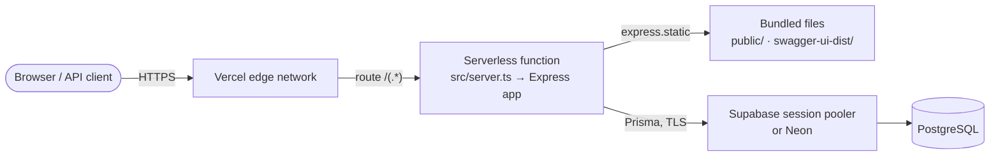
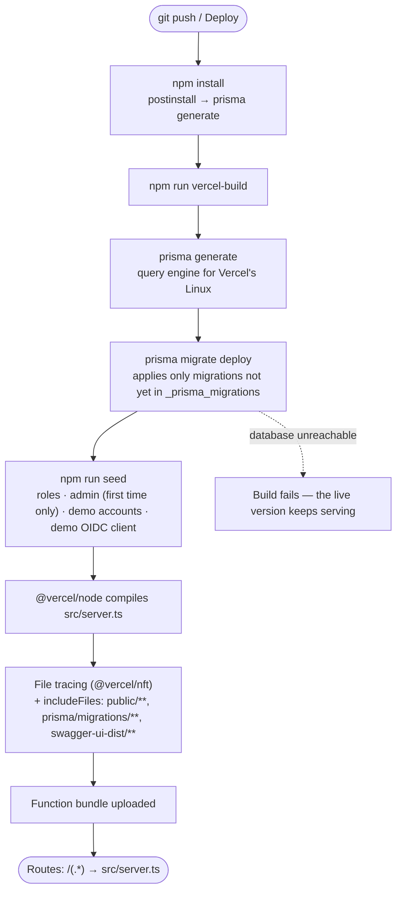
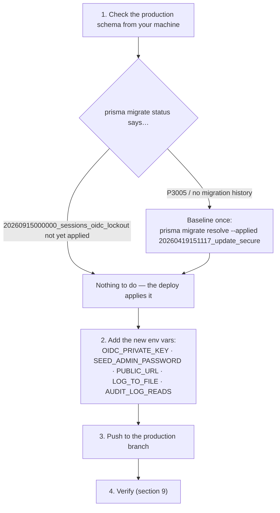
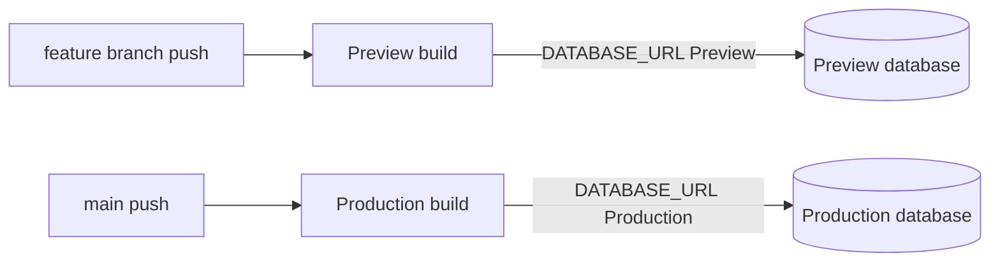

# Deploying SecureAccess to Vercel — Step by Step

This guide deploys the API, the interactive console and Swagger UI to **Vercel (free Hobby plan)** with a **free PostgreSQL** database (Supabase or Neon).

> Prefer a long-running server? See [DEPLOYMENT.md](DEPLOYMENT.md) for Render + Neon. Both setups use the same code.

## Contents

1. [How SecureAccess runs on Vercel](#1-how-secureaccess-runs-on-vercel)
2. [Before you start](#2-before-you-start)
3. [Step 1 — Create the database](#3-step-1--create-the-database)
4. [Step 2 — Generate secrets](#4-step-2--generate-secrets)
5. [Step 3 — Import the project](#5-step-3--import-the-project)
6. [Step 4 — Add environment variables](#6-step-4--add-environment-variables)
7. [Step 5 — Deploy](#7-step-5--deploy)
8. [Step 6 — Set PUBLIC_URL and redeploy](#8-step-6--set-public_url-and-redeploy)
9. [Step 7 — Verify the deployment](#9-step-7--verify-the-deployment)
10. [Updating an existing (v2) Vercel deployment](#10-updating-an-existing-v2-vercel-deployment)
11. [How Swagger UI works on Vercel](#11-how-swagger-ui-works-on-vercel)
12. [Preview deployments and the database](#12-preview-deployments-and-the-database)
13. [Deploying from the command line](#13-deploying-from-the-command-line)
14. [Vercel limits to know about](#14-vercel-limits-to-know-about)
15. [Troubleshooting](#15-troubleshooting)

---

## 1. How SecureAccess runs on Vercel

Vercel does not run a permanent server. Each request starts (or reuses) a **serverless function** that contains the whole Express app.



| Piece | File | What it does |
|---|---|---|
| Build config | [`vercel.json`](../vercel.json) | One `@vercel/node` function built from `src/server.ts`; every path routes to it; `includeFiles` bundles `public/`, `prisma/migrations/` and `swagger-ui-dist/` |
| Entry point | [`src/server.ts`](../src/server.ts) | Exports the Express app. It only calls `listen()` when `VERCEL` is **not** set |
| Build script | `vercel-build` in [`package.json`](../package.json) | `prisma generate && prisma migrate deploy && npm run seed` — runs on every deploy |
| Upload filter | [`.vercelignore`](../.vercelignore) | Keeps `.env`, keys, tests and logs out of CLI uploads |

**Serverless-specific handling already in the code**

| Concern | How it's handled |
|---|---|
| Work after the response (audit log rows) | `waitUntil()` from `@vercel/functions` keeps the function alive until the insert finishes |
| Read-only filesystem | File logs go to `/tmp/logs`; set `LOG_TO_FILE=false` to use console logs only (visible in Vercel → Logs) |
| Static files | `public/` and Swagger's assets are traced into the bundle and served by Express |
| Schema drift | `/health` reports pending migrations; missing-column errors return `503 SCHEMA_OUT_OF_DATE` with a fix hint in the logs |

---

## 2. Before you start

- [ ] A GitHub account with this repository pushed to it
- [ ] A [Vercel](https://vercel.com) account (Hobby plan is free; sign in with GitHub)
- [ ] A free database: [Supabase](https://supabase.com) or [Neon](https://neon.tech)
- [ ] Node.js 20+ locally (to generate secrets)

Time needed: about 15 minutes.

---

## 3. Step 1 — Create the database

Vercel's build machines and functions connect over **IPv4**. Choose your provider:

### Option A — Supabase

1. Create a project (pick the region closest to where your Vercel functions will run, e.g. `us-east-1` / Washington D.C.).
2. Click **Connect** in the top bar → **Connection string** → choose **Session pooler**.
3. Copy the URI and put your database password in it:

   ```text
   postgresql://postgres.<project-ref>:<password>@aws-0-<region>.pooler.supabase.com:5432/postgres
   ```

4. Append the parameters for serverless use:

   ```text
   ...pooler.supabase.com:5432/postgres?sslmode=require&connection_limit=1
   ```

| Why the **session pooler** (port 5432 on `pooler.supabase.com`)? |
|---|
| The **direct** host `db.<ref>.supabase.co` is IPv6-only on free projects, and Vercel cannot reach it (`P1001: Can't reach database server`). |
| The **transaction** pooler (port 6543) does not support the statements `prisma migrate deploy` needs. |
| `connection_limit=1` stops each function instance from opening a pool of connections, so the free tier's connection limit is not exhausted. |

### Option B — Neon

1. Create a project in the same region as your Vercel functions.
2. **Connection Details** → turn **Connection pooling off** (use the direct host) → copy the string.
3. Append `?sslmode=require&connection_limit=1` (use `&` instead if the URL already has parameters).

> You do **not** create tables by hand. The deploy runs `prisma migrate deploy`.

---

## 4. Step 2 — Generate secrets

Run these in the project folder and keep the output in a password manager.

```bash
node -e "console.log(require('crypto').randomBytes(48).toString('base64url'))"
```

↑ your `JWT_SECRET` (32+ characters).

```bash
npm run keys:generate
```

↑ prints `OIDC_PRIVATE_KEY=...`. Copy only the value after `=`. It must stay the same across deployments; otherwise OpenID Connect tokens issued by one function instance fail on another.

Also choose a strong **admin password** (12+ characters with upper, lower, digit and symbol; no words like "admin" or "password") for `SEED_ADMIN_PASSWORD`.

---

## 5. Step 3 — Import the project

1. In Vercel: **Add New… → Project → Import** your GitHub repository.
2. **Framework Preset:** `Other`.
3. **Root Directory:** the folder containing `vercel.json` (the repository root).
4. Leave **Build and Output Settings** as they are. Because `vercel.json` has a `builds` section, Vercel shows *"Build and Development Settings defined in your Project Settings will not apply"*. That is expected — the build is controlled by `vercel.json` and the `vercel-build` script.
5. **Don't click Deploy yet.** Add the environment variables first (next step); the first build needs `DATABASE_URL` to run migrations.

> Already imported and the first build failed? No problem — add the variables, then **Deployments → ⋯ → Redeploy**.

---

## 6. Step 4 — Add environment variables

Vercel → your project → **Settings → Environment Variables**.

| Name | Value | Production | Preview |
|---|---|:-:|:-:|
| `DATABASE_URL` | connection string from step 1 | ✅ | see [section 12](#12-preview-deployments-and-the-database) |
| `JWT_SECRET` | from step 2 | ✅ | ✅ |
| `OIDC_PRIVATE_KEY` | from step 2 (value only) | ✅ | ✅ |
| `SEED_ADMIN_PASSWORD` | your admin password | ✅ | ✅ |
| `NODE_ENV` | `production` | ✅ | ✅ |
| `LOG_TO_FILE` | `false` | ✅ | ✅ |
| `AUDIT_LOG_READS` | `false` (keeps the free database small) | ✅ | ✅ |
| `PUBLIC_URL` | leave empty for now (step 6) | ✅ | ❌ leave unset |
| `SEED_ADMIN_EMAIL` | optional, default `admin@secureaccess.dev` | optional | optional |
| `ALLOWED_ORIGINS` | optional, default `*` | optional | optional |

Also recommended in **Settings**:

| Setting | Where | Value |
|---|---|---|
| Node.js version | General → Node.js Version | `22.x` |
| Function region | Functions → Function Region | same region as your database (every request makes several queries, so distance matters) |

---

## 7. Step 5 — Deploy

Click **Deploy** (or push to your production branch). This is what happens:



Watch the **Build Logs**. A healthy build contains lines like:

```text
All migrations have been successfully applied.      (or: No pending migrations to apply.)
Created admin admin@secureaccess.dev                (first deploy only)
Demo accounts ready: auditor@secureaccess.dev, demo@secureaccess.dev
OIDC client ready: secureaccess-demo
```

> If you did not set `SEED_ADMIN_PASSWORD`, the seed generates one and prints it **once** in this log. Copy it.

---

## 8. Step 6 — Set PUBLIC_URL and redeploy

1. Copy your production domain from the project **Overview** or **Settings → Domains** (current deployment: `https://secure-access-a8j6fkex8-ramraghuls-projects.vercel.app`).
2. **Settings → Environment Variables → `PUBLIC_URL`** = that URL (no trailing slash), **Production only**.
3. **Deployments → ⋯ (latest) → Redeploy**.

`PUBLIC_URL` becomes the OpenID Connect **issuer**. It also enables the CSP `upgrade-insecure-requests` directive for HTTPS. Preview deployments leave it unset so the issuer follows each preview's own URL.

Also set `DEPLOYED_URL` (any environment, including your local `.env`) to the same domain. It is the *Deployed* entry in Swagger's **Servers** dropdown.

### Make the site public (Deployment Protection)

New Vercel projects protect deployments with **Vercel Authentication**: visitors are redirected to `vercel.com/sso-api` and must log in to *your* Vercel account — portfolio visitors would only see a login page.

1. **Settings → Deployment Protection → Vercel Authentication** → **Disabled** (or keep it for preview deployments only).
2. Share the **production domain** (Settings → Domains). Per-deployment URLs such as `secure-access-a8j6fkex8-ramraghuls-projects.vercel.app` change on every deploy.

Check it the way a visitor would:

```bash
curl -I https://secure-access-a8j6fkex8-ramraghuls-projects.vercel.app/health
```

`HTTP/2 200` means public; `302` with `location: https://vercel.com/sso-api` means still protected.

---

## 9. Step 7 — Verify the deployment

Replace `APP` with your domain.

```bash
APP=https://secure-access-a8j6fkex8-ramraghuls-projects.vercel.app
```

```bash
curl -s $APP/health
```

Expected: `{"status":"ok","database":"up","migrations":"up-to-date",...}`

| Check | Expected |
|---|---|
| `APP/health` | `status: ok`, `migrations: up-to-date` |
| `APP/` | Console loads, header pill says **API online** |
| `APP/api-docs` | Redirects to `/api-docs/`, Swagger UI renders |
| `APP/swagger-ui-assets/swagger-ui.css` | `200` (Swagger assets are in the bundle) |
| `APP/swagger.json` | OpenAPI JSON |
| `APP/.well-known/openid-configuration` | `issuer` equals your `PUBLIC_URL` |
| Console → sign in as `auditor@secureaccess.dev` / `Auditor!Demo#2026` | Users, Roles, Audit tabs visible |
| Console → **OpenID Connect** → demo sign-in | Every step on the callback page is ticked |
| Swagger → `POST /api/v1/auth/login` → **Authorize** → `GET /api/v1/auth/me` | `200` |

---

## 10. Updating an existing (v2) Vercel deployment

If your project was already deployed with v2 (for example `secure-access-kappa.vercel.app` on Supabase):



**1. Check the production schema** (use the same connection string as Vercel's `DATABASE_URL`):

```bash
DATABASE_URL="postgresql://postgres.<ref>:<password>@aws-0-<region>.pooler.supabase.com:5432/postgres?sslmode=require" npx prisma migrate status
```

- *"Following migration have not yet been applied: 20260915000000_sessions_oidc_lockout"* → fine, the next deploy applies it.
- *P3005* or no `_prisma_migrations` table (the database was created with `db push`) → mark the v2 baseline as applied once:

  ```bash
  DATABASE_URL="<same url>" npx prisma migrate resolve --applied 20260419151117_update_secure
  ```

**What changes for existing data**

- The migration only **adds** columns and tables — no data is removed.
- Users keep their passwords. v2 tokens stop working; everyone signs in again.
- The v2 admin `admin@secureaccess.ca` keeps its account. Set `SEED_ADMIN_EMAIL=admin@secureaccess.ca` if you want the seed to manage that account instead of creating `admin@secureaccess.dev`.
- API clients must use `accessToken` (not `token`) from the login response, and treat `202` (not `206`) as "MFA required".

> **The error `The column users.isProtected does not exist`** means new code is running against the old schema: migrations were not applied. Run `npx prisma migrate deploy` against that database (locally: `npm run migrate:deploy`, then `npm run seed`). On Vercel this happens automatically in `vercel-build`; if the build could not reach the database, the build fails instead of deploying.

---

## 11. How Swagger UI works on Vercel

The v2 docs page was blank on Vercel. v3 fixes the two causes.

```mermaid
sequenceDiagram
    autonumber
    participant B as Browser
    participant F as Vercel function (Express)
    B->>F: GET /api-docs
    F-->>B: 301 → /api-docs/
    B->>F: GET /api-docs/
    F-->>B: HTML (swagger-ui-express setup)
    par assets resolved relative to /api-docs/
        B->>F: GET /api-docs/swagger-ui.css
        B->>F: GET /api-docs/swagger-ui-bundle.js
        B->>F: GET /api-docs/swagger-ui-init.js
    end
    F-->>B: files from bundled node_modules/swagger-ui-dist + init script with the spec embedded
    B->>B: Swagger UI renders; "Try it out" calls the same origin
```

| Cause of the blank page | Fix in [`src/swagger/docs.ts`](../src/swagger/docs.ts) |
|---|---|
| Swagger UI's asset files were not in the function bundle. They are read from disk at runtime, which a bundler can't see. | The folder is referenced with a literal `path.join(__dirname, "../../node_modules/swagger-ui-dist")` and served at `/swagger-ui-assets` ("direct access"). Vercel's tracer recognises this pattern and copies the folder; `vercel.json` also lists it in `includeFiles`. |
| The HTML loads `./swagger-ui.css` relatively. At `/api-docs` (no slash) that means `/swagger-ui.css`, which is a 404. | `/api-docs` redirects to `/api-docs/`, so relative URLs resolve to `/api-docs/swagger-ui.css`. |

The page is served entirely from your own domain (no CDN), so it also works behind strict networks and passes the `script-src 'self'` Content-Security-Policy.

**Check the bundle yourself** — this runs the same file tracer Vercel uses:

```bash
npm run build
```

```bash
npx @vercel/nft print dist/server.js | grep -E "swagger-ui-dist/swagger-ui-bundle.js|public/index.html|migration.sql"
```

---

## 12. Preview deployments and the database

Every push to a non-production branch creates a **Preview** deployment, and it runs `vercel-build` too — **including `prisma migrate deploy`**. If Preview uses the production `DATABASE_URL`, a migration on a feature branch changes the production database before you merge.



Pick one:

| Option | How |
|---|---|
| Separate preview database (recommended) | Create a second free Supabase project or a Neon **branch**, set it as `DATABASE_URL` for **Preview** only |
| No preview deployments | Settings → Git → **Ignored Build Step** → "Only build production" |
| Accept the risk | Only if you never add migrations on branches |

---

## 13. Deploying from the command line

```bash
npm i -g vercel
```

```bash
vercel login
```

```bash
vercel link
```

```bash
vercel env add DATABASE_URL production
```

Repeat `vercel env add` for each variable in [section 6](#6-step-4--add-environment-variables), then:

```bash
vercel --prod
```

Useful extras:

| Command | Purpose |
|---|---|
| `vercel env pull .env.vercel` | Download the project's variables (e.g. to run `prisma migrate status` against production) |
| `vercel logs <deployment-url>` | Stream function logs |
| `vercel rollback` | Switch production back to the previous deployment |

---

## 14. Vercel limits to know about

| Topic | Hobby plan behaviour | Effect on SecureAccess |
|---|---|---|
| Function duration | 10 s default | Fine — the slowest request (bcrypt login) takes ~0.3 s |
| Cold starts | First request after idle is slower (~1–2 s) | Noticeable only on the first call |
| Instances | Many can run in parallel | Rate-limit counters are per instance, so limits are approximate |
| Filesystem | Read-only except `/tmp` | Use `LOG_TO_FILE=false`; logs appear in Vercel → Logs |
| Bundle size | 250 MB unzipped | Current bundle is far below (Swagger assets ≈ 10 MB) |
| Usage | Personal, non-commercial projects | Suits a portfolio |

---

## 15. Troubleshooting

| Symptom | Cause | Fix |
|---|---|---|
| Build log: `P1001 Can't reach database server` | Supabase **direct** host (IPv6-only) or wrong password | Use the **session pooler** URL from step 1 |
| Build log: `SEED_ADMIN_PASSWORD is too weak: …` | The admin password breaks a rule — often it contains `admin` | Change `SEED_ADMIN_PASSWORD` in Settings → Environment Variables (12+ chars, upper, lower, digit, symbol, none of `password` `123456` `qwerty` `admin` `letmein`), then **Redeploy**. Migrations already applied are skipped. |
| Build log: `P3005 The database schema is not empty` | Existing DB created without migrations | Baseline — [section 10](#10-updating-an-existing-v2-vercel-deployment) |
| Runtime: `The column users.isProtected does not exist` / `503 SCHEMA_OUT_OF_DATE` | Migrations not applied to that database | `npx prisma migrate deploy` against it, then redeploy |
| `/health` shows `"migrations": "pending"` | Same as above | Same as above |
| Swagger page blank | Opened an old deployment, or assets 404 | Redeploy; check `APP/swagger-ui-assets/swagger-ui.css` returns 200 |
| `FUNCTION_INVOCATION_FAILED` on every request | App crashed at startup — usually a missing `DATABASE_URL`/`JWT_SECRET` or `JWT_SECRET` shorter than 32 characters | Vercel → Logs shows the exact message; fix the variable and redeploy |
| OIDC demo: `id_token signature` step fails | `OIDC_PRIVATE_KEY` not set, so each instance generates its own key | Set `OIDC_PRIVATE_KEY` |
| OIDC demo: `redirect_uri is not registered` | `PUBLIC_URL` differs from the domain in the browser (e.g. on a preview) | Set `PUBLIC_URL` only for Production; open the production domain |
| `too many connections` / `MaxClientsInSessionMode` | Connection pool exhausted | Add `connection_limit=1` to `DATABASE_URL` |
| Admin password unknown | Seed generated it | Find it in the first build log, or set `SEED_ADMIN_EMAIL` to a new address and redeploy |
| Requests are slow (~1 s each) | Function region far from the database | Settings → Functions → set the database's region |
| Every URL redirects to `vercel.com/sso-api` / visitors see a Vercel login | Deployment Protection (Vercel Authentication) is on | Settings → Deployment Protection → disable it — see [step 6](#8-step-6--set-public_url-and-redeploy) |
| Swagger *Deployed* server fails from the local docs | Deployment still protected, or `DEPLOYED_URL` points at an old per-deployment URL | Make the site public and set `DEPLOYED_URL` to the production domain |
